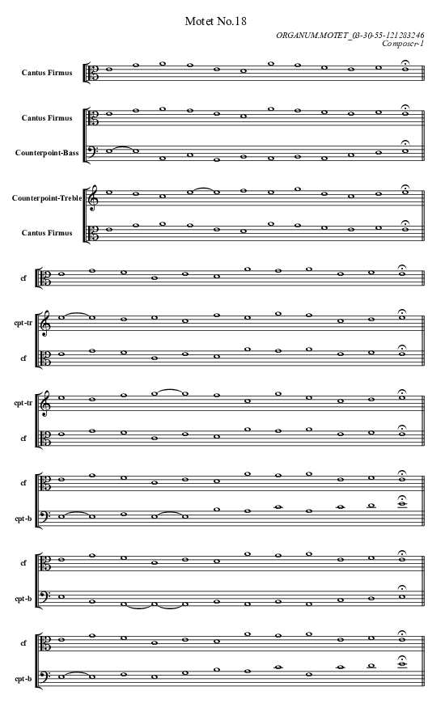

# Composer-1 of 03-30-55-121283246
20 Organum Motets in Phrygian Mode.

<table>
<tr>
<td align="center" valign="top"></td>
<td align="center" valign="top"></td>
</tr>
<tr>
<td>Scheme = CF - Bas - Tre - CF - Tre - Bas -</td>
<td>Scheme = CF - Tre - Bas - CF - Tre - Bas -</td>
</tr>
<tr>
<td align="center"><a href="https://soundcloud.com/03-30-55-12-1/motet-01">Listen</a></td>
<td align="center"><a href="https://soundcloud.com/03-30-55-12-1/motet-02">Listen</a></td>
</tr>
</table><table>
<tr>
<td align="center" valign="top"></td>
<td align="center" valign="top"></td>
</tr>
<tr>
<td>Scheme = CF - Tre - Bas - CF - Bas - Tre -</td>
<td>Scheme = CF - Bas - Bas - Tre - CF - Bas - Tre</td>
</tr>
<tr>
<td align="center"><a href="https://soundcloud.com/03-30-55-12-1/motet-03">Listen</a></td>
<td align="center"><a href="https://soundcloud.com/03-30-55-12-1/motet-04">Listen</a></td>
</tr>
</table><table>
<tr>
<td align="center" valign="top"></td>
<td align="center" valign="top"></td>
</tr>
<tr>
<td>Scheme = CF - Bas - Tre - Tre - CF - Tre - Bas</td>
<td>Scheme = CF - Tre - Tre - Bas - CF - Bas - Tre</td>
</tr>
<tr>
<td align="center"><a href="https://soundcloud.com/03-30-55-12-1/motet-05">Listen</a></td>
<td align="center"><a href="https://soundcloud.com/03-30-55-12-1/motet-06">Listen</a></td>
</tr>
</table><table>
<tr>
<td align="center" valign="top"></td>
<td align="center" valign="top"></td>
</tr>
<tr>
<td>Scheme = CF - Tre - Tre - Bas - Bas - CF - Tre - Bas</td>
<td>Scheme = CF - Bas - Tre - Bas - CF - Bas - Tre - Tre</td>
</tr>
<tr>
<td align="center"><a href="https://soundcloud.com/03-30-55-12-1/motet-07">Listen</a></td>
<td align="center"><a href="https://soundcloud.com/03-30-55-12-1/motet-08">Listen</a></td>
</tr>
</table><table>
<tr>
<td align="center" valign="top"></td>
<td align="center" valign="top"></td>
</tr>
<tr>
<td>Scheme = CF - Tre - Bas - Bas - CF - Bas - Tre - Bas</td>
<td>Scheme = CF - Bas - Tre - CF - Tre - Tre - Bas - Bas</td>
</tr>
<tr>
<td align="center"><a href="https://soundcloud.com/03-30-55-12-1/motet-09">Listen</a></td>
<td align="center"><a href="https://soundcloud.com/03-30-55-12-1/motet-10">Listen</a></td>
</tr>
</table><table>
<tr>
<td align="center" valign="top"></td>
<td align="center" valign="top"></td>
</tr>
<tr>
<td>Scheme = CF - Tre - Tre - Bas - CF - Bas - Bas - Tre</td>
<td>Scheme = CF - Tre - Bas - Bas - CF - Tre - Bas - Bas</td>
</tr>
<tr>
<td align="center"><a href="https://soundcloud.com/03-30-55-12-1/motet-11">Listen</a></td>
<td align="center"><a href="https://soundcloud.com/03-30-55-12-1/motet-12">Listen</a></td>
</tr>
</table><table>
<tr>
<td align="center" valign="top"></td>
<td align="center" valign="top"></td>
</tr>
<tr>
<td>Scheme = CF - Tre - Tre - Bas - CF - Bas - Tre - Tre</td>
<td>Scheme = CF - Tre - Tre - Bas - CF - Tre - Bas - Bas</td>
</tr>
<tr>
<td align="center"><a href="https://soundcloud.com/03-30-55-12-1/motet-13">Listen</a></td>
<td align="center"><a href="https://soundcloud.com/03-30-55-12-1/motet-14">Listen</a></td>
</tr>
</table><table>
<tr>
<td align="center" valign="top"></td>
<td align="center" valign="top"></td>
</tr>
<tr>
<td>Scheme = CF - Tre - Tre - Tre - Bas - CF - Tre - Bas - Bas</td>
<td>Scheme = CF - Tre - Bas - Tre - Tre - Tre - CF - Bas - Tre</td>
</tr>
<tr>
<td align="center"><a href="https://soundcloud.com/03-30-55-12-1/motet-15">Listen</a></td>
<td align="center"><a href="https://soundcloud.com/03-30-55-12-1/motet-16">Listen</a></td>
</tr>
</table><table>
<tr>
<td align="center" valign="top"></td>
<td align="center" valign="top"></td>
</tr>
<tr>
<td>Scheme = CF - Bas - Bas - Tre - CF - Tre - Tre - Bas - Bas</td>
<td>Scheme = CF - Bas - Tre - CF - Tre - Tre - Bas - Bas - Bas</td>
</tr>
<tr>
<td align="center"><a href="https://soundcloud.com/03-30-55-12-1/motet-17">Listen</a></td>
<td align="center"><a href="https://soundcloud.com/03-30-55-12-1/motet-18">Listen</a></td>
</tr>
</table><table>
<tr>
<td align="center" valign="top"></td>
<td align="center" valign="top"></td>
</tr>
<tr>
<td>Scheme = CF - Tre - Bas - Tre - Bas - CF - Tre - Tre - Bas</td>
<td>Scheme = CF - Tre - Bas - Bas - CF - Bas - Tre - Tre - Tre</td>
</tr>
<tr>
<td align="center"><a href="https://soundcloud.com/03-30-55-12-1/motet-19">Listen</a></td>
<td align="center"><a href="https://soundcloud.com/03-30-55-12-1/motet-20">Listen</a></td>
</tr>
</table>